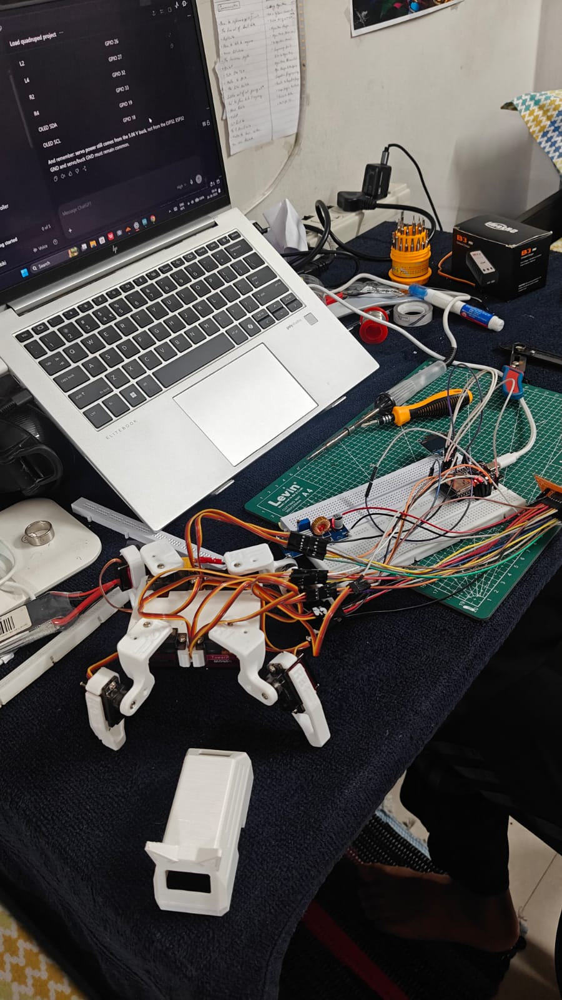
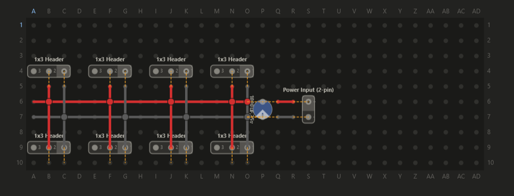
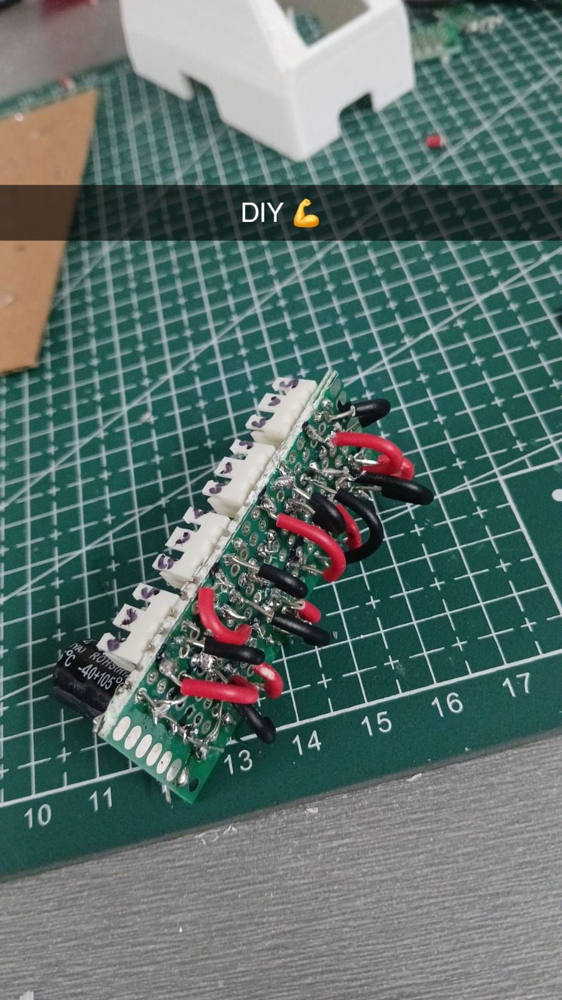

<div align="center">

# 🐾 QUARAPET

### An 8-servo, Wi-Fi-controlled, DIY quadruped robot with a face that has feelings.

*3D-printed. ESP32-S3 powered. Hand-soldered. Fully open source.*

<br>


<br>



<sub><i>The prototype mid-build: legs on, wires everywhere, laptop open. This is how it actually happens. 😄</i></sub>

<br><br>

**[🎬 Watch the demo](demo_prototype/prefinshed_build_demo.mp4)** &nbsp;•&nbsp;
**[⚡ Quick Start](#-quick-start)** &nbsp;•&nbsp;
**[🧰 Build Guide](#-build-it-yourself)** &nbsp;•&nbsp;
**[🎮 Controls](#-controls--moves)** &nbsp;•&nbsp;
**[🗂 Repo Map](#-repo-map)**

</div>

---

## 👀 What is Quarapet?

**Quarapet** is a pocket-sized four-legged robot pet that walks, dances, waves, does pushups, plays dead, and expresses its mood on a tiny OLED face.

Power it on and it spins up its **own Wi-Fi network**. Connect with your phone, a **captive portal pops open**, and you're driving a robot dog from your browser. No app, no Bluetooth pairing, no nonsense.

It's built to be **cheap, hackable, and buildable at home** with a 3D printer, a soldering iron, and a free weekend.

---

## ✨ Features

| | |
|---|---|
| 🦿 **8-DOF quadruped** | Two servos per leg for real walking, turning, and crab-stepping |
| 📡 **Self-hosted Wi-Fi AP** | Creates its own hotspot with a **captive portal**, so the control page auto-opens |
| 🏠 **Optional home Wi-Fi mode** | Join your own network from the web UI; reach it via `quarapet-robot.local` |
| 😎 **Animated OLED face** | 38 face sets with multi-frame animations: moods, talking variants, idle blinks |
| 🕺 **20+ built-in moves** | Walk, dance, wave, swim, pushup, bow, worm, moonwalk-ish chaos, and more |
| 🔌 **REST-style API** | `/api/command`, `/api/status`, `/api/wifi/*`, so you can script it or plug it into other things |
| 🎚️ **Live servo subtrim** | Calibrate each servo from the web UI without re-flashing |
| 🔋 **Battery powered** | Single 850 mAh LiPo, onboard switch, decoupling cap on the servo rail |
| 🖨️ **Fully printable** | Every structural part ships as an STL, with a cat-ear top cover 🐱 |

---

## 🎮 Controls & Moves

Everything is triggered from the web UI (or via `/cmd` and `/api/command`).

| Category | Commands |
|---|---|
| 🚶 **Locomotion** | `forward` · `backward` · `left` · `right` |
| 🧍 **Poses** | `stand` · `rest` · `dead` |
| 🎉 **Show-off** | `dance` · `wave` · `bow` · `cute` · `freaky` · `shake` · `shrug` |
| 💪 **Tricks** | `pushup` · `point` · `swim` · `worm` · `crab` |

### 😶 The Face Engine

The OLED isn't just a status light. It runs a frame-based animation system with **38 face sets**:

`happy` · `sad` · `angry` · `surprised` · `sleepy` · `love` · `excited` · `confused` · `thinking` · `idle` · `idle_blink` · plus a matching **`talk_*`** variant for each mood, and a face for every move (`walk`, `dance`, `wave`, `dead`, `crab`...).

When idle, Quarapet blinks on its own. When nobody's touched it for a while, it scrolls its Wi-Fi credentials across the screen so you never forget how to connect. 🙌

---

## ⚡ Quick Start

### 1. Flash the firmware

1. Install the **Arduino IDE** with the **ESP32 board package**.
2. Install these libraries from the Library Manager:
   - `ESP32Servo`
   - `Adafruit GFX Library`
   - `Adafruit SSD1306`
3. Open [`qurapet_firmware/sesame-firmware-main.ino`](qurapet_firmware/sesame-firmware-main.ino). The three `.h` files in the same folder load automatically.
4. Select your ESP32 board, pick the port, and hit **Upload**.

> ⚠️ **Check your pins!** The `servoPins[]` array near the top of the `.ino` is set for a specific board. If you wire to different GPIOs (see the [schematic](schematic/circuit_diagram.pdf)), update that array to match. Servo order is `R1, R2, L1, L2, R4, R3, L3, L4`.

### 2. Power on & connect

| | |
|---|---|
| 📶 **Wi-Fi name** | `quarapet` |
| 🔑 **Password** | `12345678` |
| 🌐 **Address** | `192.168.4.1` (the captive portal should open automatically) |

> 🔒 Change `AP_SSID` and `AP_PASS` in the firmware before you take it anywhere public.

### 3. Drive it 🚗

Tap a button. Watch it move. Smile at the tiny face. That's the whole product.

### 🏠 Want it on your home Wi-Fi?

Use the Wi-Fi setup panel in the web UI (it scans and connects at runtime), or set `NETWORK_SSID`, `NETWORK_PASS` and `ENABLE_NETWORK_MODE true` in the firmware. Then reach it at **`http://quarapet-robot.local`**.

---

## 🧰 Build It Yourself

### 1️⃣ Print the parts

All STLs live in [`cad_files/`](cad_files). Printed in white PLA in the prototype.

| Part | Files |
|---|---|
| 🦴 **Body frame** | `Internal-Frame-v121.stl` |
| 🔽 **Bottom cover** | `Bottom-Cover-v121.stl` |
| 🐱 **Top cover (cat ears!)** | `Top-Cover-Cat-v100.stl` |
| 🦵 **Left legs** | `L1` · `L2` · `L3` · `L4` (`-v117`) |
| 🦵 **Right legs** | `R1` · `R2` · `R3` · `R4` (`-v117`) |

### 2️⃣ Gather the parts

<details>
<summary><b>🔌 Electronics BOM</b> (click to expand)</summary>

<br>

| Component | Qty | Details |
|---|:---:|---|
| **TowerPro MG90S Servo** | 8 | Metal-gear micro servo |
| **ESP32-S3-N16R8** | 1 | Main controller |
| **LiPo Battery** | 1 | 850 mAh |
| **Power Switch** | 1 | ON/OFF |
| **OLED Display** | 1 | 0.96″ SSD1306 (I²C) |
| **Electrolytic Capacitor** | 1 | 100 µF, 25 V (10 V+ is fine) |

Full list: [`BOM/Electronics/parts.md`](BOM/Electronics/parts.md)

</details>

<details>
<summary><b>🔧 Tools & hardware BOM</b> (click to expand)</summary>

<br>

| Item | Spec |
|---|---|
| Phillips screws | M3 × 2.5 mm and M3 × 3 mm |
| Precision screwdriver kit | Multi-bit |
| Hot glue gun | Strain relief and wire fixing |
| Soldering iron + solder | Electronics grade |
| Perfboard | 5 × 7 cm |
| 3-pin headers | For servo connectors |

Full list with safety notes: [`BOM/mechanical_parts/mech_parts.md`](BOM/mechanical_parts/mech_parts.md)

</details>

### 3️⃣ Build the servo power board

Eight servos pull serious current, so they get a dedicated power rail with a bulk capacitor instead of leeching from the ESP32. The board is a simple perfboard distribution unit: **8 × 3-pin headers**, one shared **+ rail**, one shared **GND rail**, a **100 µF cap**, and a **2-pin power input**.

<div align="center">



<sub><i>Perfboard layout: red is +V, grey is GND. Follow the grid coordinates.</i></sub>

<br><br>



<sub><i>The finished board, hand-soldered. Pure DIY. 💪</i></sub>

</div>

> 💡 **Golden rule:** servo power comes from the battery/regulated supply, **not** from the ESP32's 3.3 V pin. Servo GND and ESP32 GND **must be shared**.

### 4️⃣ Wire it up

Follow the full wiring diagram: **[`schematic/circuit_diagram.pdf`](schematic/circuit_diagram.pdf)**

| Connection | Pin |
|---|---|
| OLED **SDA** | GPIO 17 |
| OLED **SCL** | GPIO 18 |
| 8× servo signal | See `servoPins[]` in firmware |
| Servo V+ / GND | Perfboard power rail |

### 5️⃣ Assemble, flash, calibrate

1. Mount servos in the frame with the M3 screws.
2. Center all servos (run `stand`) *before* attaching the leg horns.
3. Fit the legs, tidy the wires, hot-glue the strain relief.
4. Close up with the cat-ear cover.
5. Fine-tune any crooked legs using **subtrim** in the web UI.

---

## 🎬 See It Move

<div align="center">

**[▶️ Click here to watch the prototype demo](demo_prototype/prefinshed_build_demo.mp4)**

</div>

---

## 🗂 Repo Map

```
Quarapet/
├── 📁 BOM/
│   ├── Electronics/parts.md          # Electronic components list
│   └── mechanical_parts/mech_parts.md # Tools, screws & materials
├── 📁 Power_supply_build_guide/
│   └── perfboard_layout.png          # Servo power board layout
├── 📁 cad_files/                     # 11 printable STL parts
├── 📁 demo_prototype/                # Build photos + demo video
├── 📁 qurapet_firmware/
│   ├── sesame-firmware-main.ino      # Main firmware: Wi-Fi, web server, servos
│   ├── movement-sequences.h          # Walk, dance, pushup & friends
│   ├── face-bitmaps.h                # OLED face animation frames
│   └── captive-portal.h              # Web control UI
└── 📁 schematic/
    └── circuit_diagram.pdf           # Full wiring schematic
```

---

## 🛠️ Hack It

- 🎨 **Add a new face:** add a bitmap to `face-bitmaps.h` and register it in `FACE_LIST`.
- 🕹️ **Add a new move:** write a `runYourPose()` in `movement-sequences.h` and hook it up in the command handler.
- 🤖 **Automate it:** hit `POST /api/command` from a script, a bot, or a smart-home hub.
- ⏱️ **Tune the feel:** tweak `frameDelay`, `walkCycles` and `motorCurrentDelay` for faster or smoother motion.

---

## 🧯 Safety

- Never solder with the battery connected.
- Use a stable iron stand and ventilate your workspace.
- Treat LiPo batteries with respect: no puncturing, no shorting, no unattended charging.
- Hot glue and soldering irons both burn. Be careful.

---

## 🤝 Contributing

Found a bug, improved a gait, or drew a better face? **PRs and issues are very welcome.** Fork it, break it, make it cooler. 🔥

---

## 🙏 Credits

Built with ❤️ by **[@seerprime](https://github.com/seerprime)**.
Thankyou **(https://github.com/dorianborian/sesame-robot/)** for inspiration
Shoutout to the open-source robotics and maker community whose quadruped designs and firmware ideas inspired this build.

---

<div align="center">

### ⭐ If Quarapet made you smile, drop a star! ⭐

*Build it. Break it. Make it yours.* 🐾

</div>